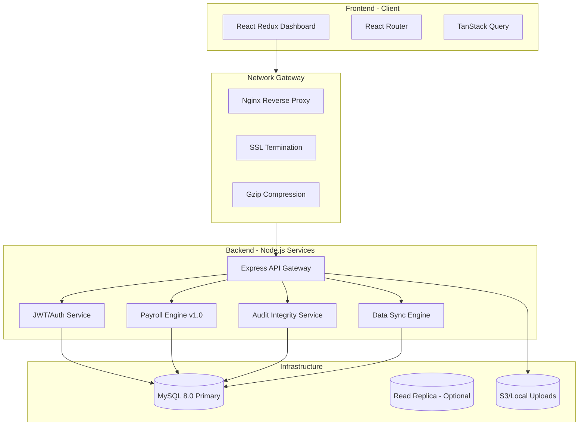
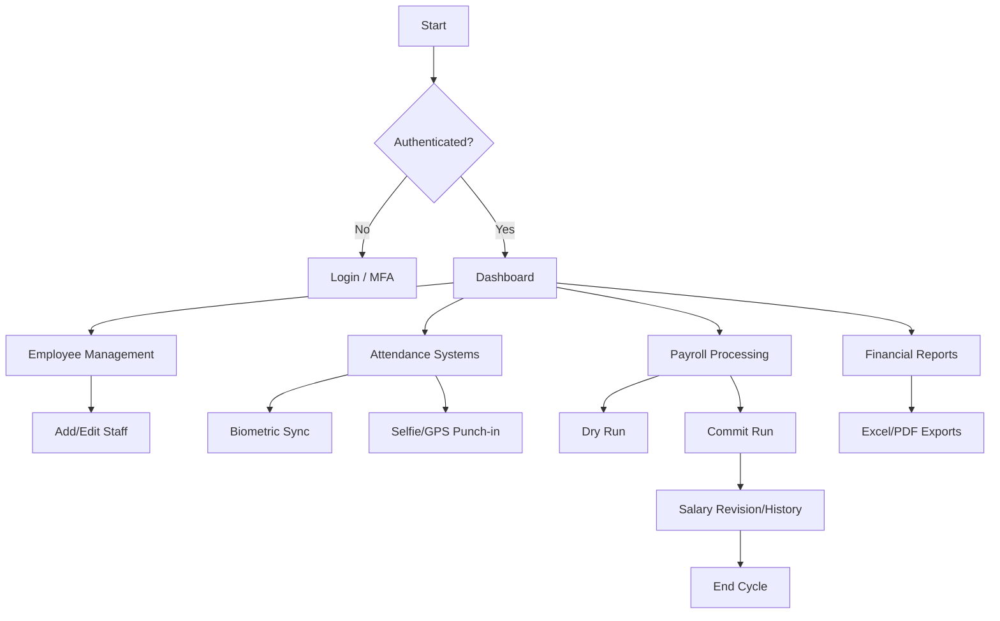
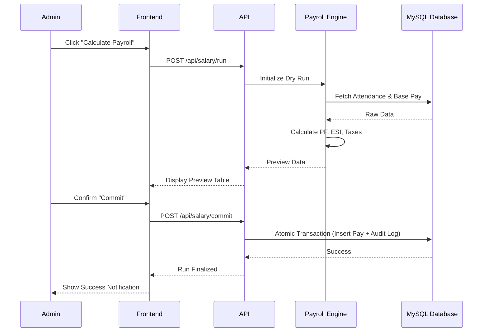
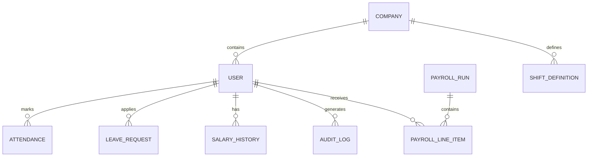
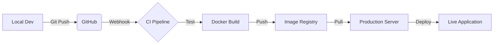

# 🚀 Enterprise Payroll & Employee Management System (EPEMS)

[](https://github.com/yourusername/enterprise-payroll)
[](LICENSE)
[](https://github.com/yourusername/enterprise-payroll)
[](https://reactjs.org/)
[](https://nodejs.org/)
[](https://www.mysql.com/)

---

## 📖 Overview

The **Enterprise Payroll & Employee Management System (EPEMS)** is a world-class, full-stack HRMS solution designed for modern organizations. It streamlines complex payroll calculations, employee lifecycle management, and financial oversight into a single, high-performance platform.

### ❓ The Problem
Modern enterprises struggle with fragmented HR data, manual payroll errors, lack of audit trails, and inefficient attendance tracking (especially for remote/field staff).

### ✨ The Solution
EPEMS provides a unified "source of truth." It automates tax/PF/ESI calculations, utilizes biometric & GPS-tagged attendance, and ensures data integrity through a cryptographic audit logging system.

---

## 🧠 System Architecture

### 📊 Architecture Diagram



### 🏗️ Architecture Explanation
*   **Client-Server Decoupling:** The React frontend (Vite-powered) interacts with the Node.js backend via a secure RESTful API.
*   **Reverse Proxy:** Nginx handles load balancing, SSL termination, and static asset serving, ensuring high availability.
*   **Multi-Tenant Ready:** Designed with tenant isolation logic, allowing multiple companies to run on the same infrastructure with data privacy.
*   **Event-Driven Sync:** Background workers handle biometric data synchronization and large report generation without blocking the main event loop.

---

## 🔄 Application Flow

### 📌 User Journey Flowchart



---

## 🔁 Sequence Diagram: Payroll Execution



---

## 🧩 Module Breakdown

### 👑 Admin & Super-Admin
*   **Organization Control:** Manage company settings, logos, and signatures.
*   **Tenant Management:** Provision and configuration for multi-company environments.

### 👥 HR & Employee Management
*   **Lifecycle Tracking:** Onboarding to retirement management.
*   **Leave Management:** Multi-level approval workflows for various leave types.
*   **Shift System:** Dynamic shift scheduling with grace periods.

### 💰 Payroll & Finance
*   **Automated Engine:** Handles statutory deductions (PF, ESI, PT) automatically.
*   **Salary Revisions:** Track increments and history with historical data preservation.
*   **Income/Expense:** Integrated ledger for tracking operational costs.

### 🛡️ Security & Integrity
*   **RBAC:** Fine-grained Role-Based Access Control (Admin, HR, Accountant, Employee).
*   **Audit Chain:** Every sensitive action is cryptographically linked to prevent log tampering.

---

## ✨ Features

*   **📍 Advanced Attendance:** Punch-in with GPS verification and selfie validation for remote teams.
*   **🔄 Biometric Integration:** Seamless API support for external biometric devices.
*   **📊 Real-time Analytics:** Interactive charts for salary trends, attendance ratios, and expense breakdowns.
*   **📥 Export System:** Generate professional Payslips (PDF) and Payroll Sheets (Excel) in seconds.
*   **🔒 Hardened Security:** Rate limiting, HTTP-only stickers, and SQL injection protection.

---

## 🧰 Tech Stack

### 🎨 Frontend
*   **React 18:** Component-based UI for high interactivity.
*   **Tailwind CSS:** Utility-first styling for a premium, responsive look.
*   **TanStack Query:** Server-state management for smooth data fetching.
*   **Framer Motion:** Micro-animations for a superior UX.

### ⚙️ Backend
*   **Node.js & Express:** High-performance asynchronous API layer.
*   **MySQL 8.0:** Robust relational data storage with ACID compliance.
*   **JWT & Bcrypt:** Industry-standard authentication and password hashing.
*   **Zod:** Strict schema validation for all API payloads.

### 🚀 DevOps
*   **Docker:** Containerization for consistent environment across Dev/Prod.
*   **Nginx:** Reverse proxy for performance and extra security.
*   **Pino:** Structured JSON logging for enterprise-grade monitoring.

---

## 📂 Project Structure

```text
├── client/                 # React (Vite) Frontend
│   ├── src/
│   │   ├── components/     # UI Design System
│   │   ├── pages/          # Dashboard & Modules
│   │   ├── context/        # Auth & Global State
│   │   └── hooks/          # Custom Hooks (Query/Debounce)
├── server/                 # Node.js Backend
│   ├── routes/             # RESTful API Endpoints
│   ├── controllers/        # Business Logic
│   ├── services/           # Heavy Operations (Payroll/Sync)
│   ├── middleware/         # Security & Auth
│   └── database/           # SQL Schemas & Migrations
└── docker-compose.yml      # Orchestration Config
```

---

## ⚙️ Installation & Setup

### 1️⃣ Clone the Repository
```bash
git clone https://github.com/yourusername/enterprise-payroll.git
cd enterprise-payroll
```

### 2️⃣ Environment Configuration
Create a `.env` file in the `server` directory:
```env
DB_HOST=localhost
DB_USER=root
DB_PASSWORD=your_password
DB_NAME=payroll_system
JWT_SECRET=your_super_secret_key
```

### 3️⃣ Launch via Docker (Recommended)
```bash
docker-compose up --build
```

### 4️⃣ Manual Start
**Backend:**
```bash
cd server
npm install
npm run dev
```
**Frontend:**
```bash
cd client
npm install
npm run dev
```

---

## 🔐 Security & Restrictions

*   **Authentication:** JWT-based stateless auth with HTTP-only cookies.
*   **Audit Trail:** Mandatory logging for every write operation with `uuid` tracking.
*   **Rate Limiting:** Protects against Brute-force and DoS (60 requests/min for sensitive routes).
*   **Input Sanitization:** Multi-layer validation via Zod and parameterized SQL queries.

---

## 🗄️ Database Design

### 📊 ER Diagram



---

## 🚀 DevOps & Deployment

### ⚙️ CI/CD & Production Workflow



*   **Containerization:** Full Docker support for portable deployments.
*   **Scalability:** Ready for horizontal scaling by decoupling the database from the app layer.
*   **Compression:** Nginx Gzip enabled for fast frontend loading.

---

## 📈 Scalability & Performance

*   **Connection Pooling:** Optimized MySQL connections via pool configuration.
*   **Query Proxy:** Intelligent routing for performance (automated DB management).
*   **Static Assets:** Served via Nginx for near-instant rendering.
*   **Caching:** (Optional) Ready for Redis integration on high-load routes.

---

## 📊 Use Cases

1.  **Manufacturing Units:** Manage large shifts and daily wages with biometric sync.
2.  **Corporate Offices:** Automate monthly payroll and income tax deductions.
3.  **Hospitals:** Track 24/7 staff rotations and specialized skill categories.
4.  **Schools/Colleges:** Manage faculty attendance, leave types, and provident funds.

---

## 🤝 Contribution Guide

1.  Fork the Project.
2.  Create your Feature Branch (`git checkout -b feature/AmazingFeature`).
3.  Commit your Changes (`git commit -m 'Add some AmazingFeature'`).
4.  Push to the Branch (`git push origin feature/AmazingFeature`).
5.  Open a Pull Request.

---

## 📜 License

Distributed under the MIT License. See `LICENSE` for more information.

---

**Designed with ❤️ by PRAWIN KUMAR N**
