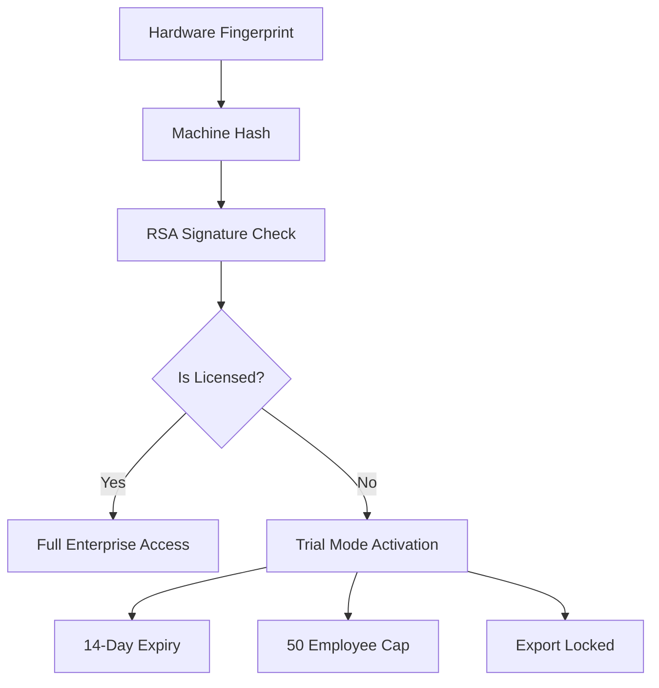

# 🔐 Commercial Licensing Engine — v1.0.0

The Enterprise Payroll System is now a **commercially protected software product**. This document outlines the security architecture used to enforce hardware-bound licensing and trial limitations.

---

## 🏗️ 1. Licensing Architecture

### 🔑 Security Components
1.  **Machine Binding**: A cryptographic fingerprint is generated using a combination of the **CPU ProcessorID** and **Disk Drive Serial Number** (via Windows WMIC).
2.  **Digital Signature**: The `license.dat` file contains a payload signed with a Developer Private Key. The application uses an embedded Public Key to verify authenticity.
3.  **Hardware Affinity**: If a database or license file is moved to a different machine, the hash mismatch will automatically trigger a "Protection Lockdown."

---

## 🛡️ 2. Anti-Tamper Protections
- **Time Rollback Detection**: The system records its `last_run_timestamp`. If the system clock is manually set back to bypass trial expiry, the application will detect the discrepancy and refuse to boot.
- **Production Isolation**: 
    - **DevTools Disabled**: Chrome Developer Tools are permanently disabled in production to prevent runtime memory manipulation or UI bypass.
    - **Dynamic Secret Injection**: Each installation generates its own unique 64-byte JWT secret, preventing cross-installation session hijacking.
- **Integrity Baseline**: Critical operations (Payroll Generation, Report Export) are gated by `license.service.js` which verifies state before execution.

---

## 🧪 3. Commercial Trial Guardrails
If no valid `license.dat` is found, the system enters **Guided Trial Mode**:
- **Duration**: 14 Days from the first run.
- **Capacity**: Maximum of **50 active employees**.
- **Utility**: Report exports and high-volume payroll cycles are restricted to prevent commercial use without activation.

---

## 💰 4. Revenue Activation Path
To move from Trial to Enterprise, the user provides their **Machine Hash** to Sales. A signed `license.dat` is generated specifically for that machine's hardware ID. 

Once placed in `%APPDATA%/enterprise-payroll-system/license.dat`, all restrictions are lifted.

*Authorized by: Commercial Product Security Group | Date: 2026-02-12*
